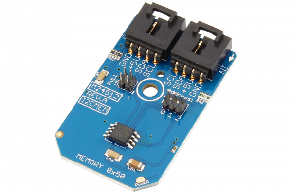

[](https://store.ncd.io/product/m24512-512k-bit-serial-eeprom-i2c-mini-module/).

# M24512

The M24512 device is a 512K-bit serial EEPROM.This memory device is compatible with the I2C extended memory standard.This EEPROM includes a built-in 4-bit unique Device Type Identifier code (1010) in accordance with the I2C bus definition. When writing data to the memory, the memory inserts an acknowledge-bit during the 9th bit time, following the bus master’s 8-bit transmission.
This Device is available from www.ncd.io

[SKU: M24512]

(https://store.ncd.io/product/m24512-512k-bit-serial-eeprom-i2c-mini-module/)
This Sample code can be used with Raspberry Pi.

Hardware needed to interface M24512 512K bit serial EEPROM module With Raspberry Pi :

1. <a href="https://store.ncd.io/product/m24512-512k-bit-serial-eeprom-i2c-mini-module/">M24512 512K bit serial EEPROM module</a>

2. <a href="https://store.ncd.io/product/i2c-shield-for-raspberry-pi-3-pi2-with-outward-facing-i2c-port-terminates-over-hdmi-port/">Raspberry Pi I2C Shield</a>

3. <a href="https://store.ncd.io/product/i%C2%B2c-cable/">I2C Cable</a>

## Python

Download and install smbus library on Raspberry pi. Steps to install smbus are provided at:

https://pypi.python.org/pypi/smbus-cffi/0.5.1

Download (or git pull) the code in pi. Run the program.

```cpp
$> python M24512.py
```
The lib is a sample library, you will need to calibrate the sensor according to your application requirement.
